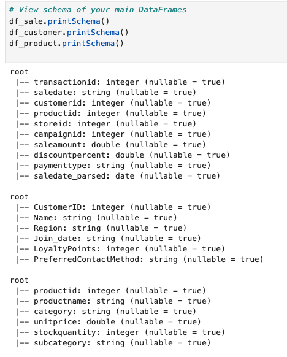
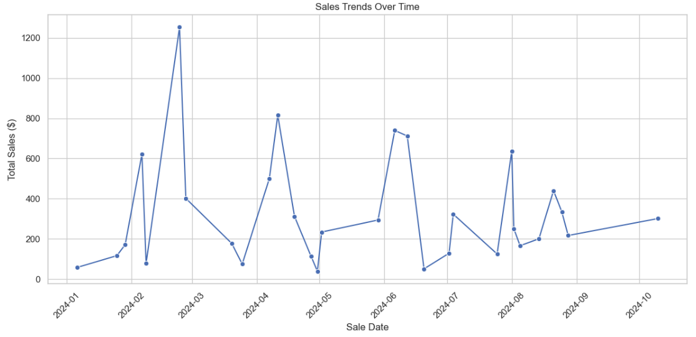
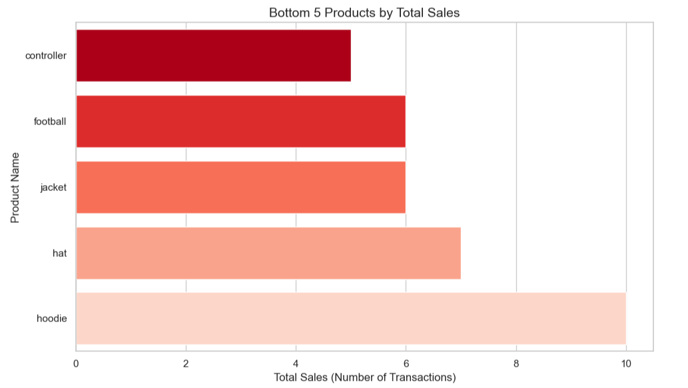
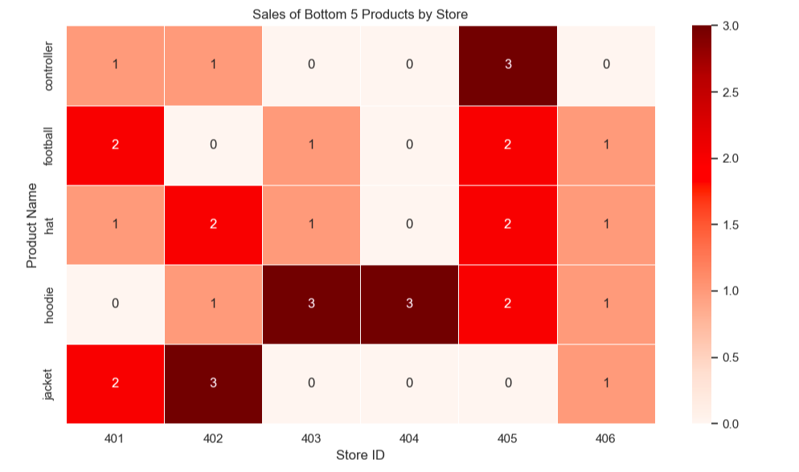
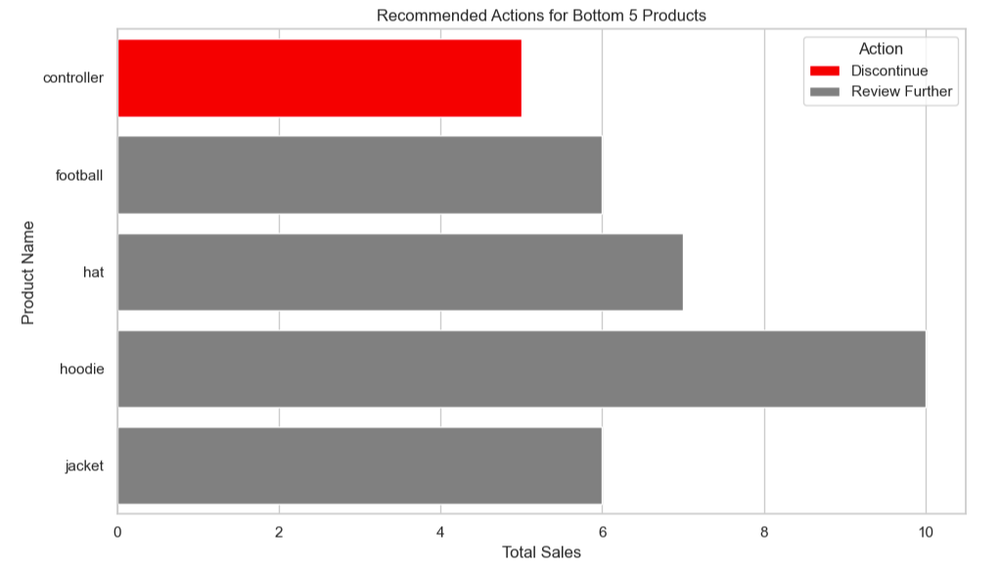

# smart-store-aaroe
BI project client 01
## Saving Changes to GitHub:

Here are the commands to save changes and push them to GitHub:

```bash
git add .
git commit -m "Update README with commands"
git push
## Loading the Project and Git

To get started with your project, follow these steps:

1. Navigate to your project directory:

```bash
cd /Users/alijah/Projects/smart-store-aaroe

### Explanation:
- **Loading the Project and Git**: This section walks the user through loading the project, initializing the git repository, adding files, committing, and pushing to GitHub.
- **Activating the Virtual Environment**: This section guides the user to navigate to the project directory and activate the virtual environment.
- Both sections have the necessary commands wrapped in **code blocks** to make them easy to follow.

### Result in `README.md`:

---

## Loading the Project and Git

To get started with your project, follow these steps:

1. Navigate to your project directory:

```bash
cd /Users/alijah/Projects/smart-store-aaroe

# Data Scrubber

This project includes a Python script for data scrubbing and testing.

## Running the Tests

To run the tests for data scrubbing, use the following command:

```bash
python3 tests/test_data_scrubber.py


ETL to Data Warehouse for Smart Store
This repository contains the ETL (Extract, Transform, Load) process for the Smart Store project, which loads cleaned customer, product, and sales data into an SQLite data warehouse for analysis.

Overview
The project consists of three major steps:

Extract - Read cleaned data from CSV files.

Transform - Perform any necessary transformations to ensure the data fits the database schema.

Load - Load the data into an SQLite database.

The final output is an SQLite database file (smart_sales.db) that contains the following tables:

customer

product

sale

Prerequisites
Python 3.x

pandas library (pip install pandas)

sqlite3 library (comes with Python by default)

SQLite database viewer (optional, for exploring the database)

File Structure
The following file structure is expected:

pgsql
Copy
/data
    /dw
        smart_sales.db  # SQLite database file
    /prepared
        customers_data_cleaned.csv
        products_data_cleaned.csv
        sales_data_cleaned.csv
/scripts
    etl_to_dw.py  # Python script to perform ETL operations
/README.md
Setup Instructions
Install the necessary libraries:

Ensure you have Python 3 and pandas installed.

bash
Copy
pip install pandas
Prepare your data:

The cleaned CSV files should be placed in the /data/prepared directory:

customers_data_cleaned.csv

products_data_cleaned.csv

sales_data_cleaned.csv

Ensure the SQLite database path is correct:

The script assumes the SQLite database (smart_sales.db) will be located in /data/dw/. If it doesn't exist, the script will create a new one.

Run the ETL script:

To run the ETL process, execute the following command:

bash
Copy
python3 scripts/etl_to_dw.py
The script will:

Drop and recreate the database tables (customer, product, sale).

Delete existing records in the tables.

Insert the cleaned data from the CSV files into the respective tables.

Check the SQLite Database:

After running the script, the smart_sales.db database will be populated with the cleaned data. You can open it using any SQLite viewer or query tool to confirm the data has been successfully loaded.

Example:

Open SQLite database file in VS Code or another SQLite viewer.

Check if the tables customer, product, and sale have been created and populated.

Key Steps in the ETL Process
Drop Existing Tables:

The script starts by dropping any existing tables in the database to ensure a fresh load each time.

python
Copy
cursor.execute("DROP TABLE IF EXISTS customer")
cursor.execute("DROP TABLE IF EXISTS product")
cursor.execute("DROP TABLE IF EXISTS sale")
Creating New Tables:

After dropping the old tables, the script creates new ones with the following schemas:

sql
Copy
CREATE TABLE IF NOT EXISTS customer (
    CustomerID INTEGER PRIMARY KEY,
    Name TEXT,
    Region TEXT,
    JoinDate TEXT,
    LoyaltyPoints INTEGER,
    PreferredContactMethod TEXT
)
Similarly, for product and sale tables, schemas are created to store the necessary information about products and sales transactions.

Inserting Data:

The cleaned data from the CSV files (customers_data_cleaned.csv, products_data_cleaned.csv, sales_data_cleaned.csv) is read into pandas DataFrames and then inserted into the corresponding database tables.

Customer data insertion:

python
Copy
customers_df.to_sql("customer", cursor.connection, if_exists="append", index=False)
Product data insertion:

python
Copy
products_df.to_sql("product", cursor.connection, if_exists="append", index=False)
Sales data insertion:

python
Copy
sales_df.to_sql("sale", cursor.connection, if_exists="append", index=False)
Error Handling:

The script includes error handling for cases like unique constraint violations (e.g., duplicate productid), and it ensures that any errors during the process are logged.

Example:

python
Copy
except sqlite3.IntegrityError as e:
    print(f"Error occurred: {e}")
Final Commit:

After all the data is successfully inserted, the changes are committed to the database:

python
Copy
conn.commit()
Troubleshooting
Database Path Errors:

If you receive an error about the database path not existing (OperationalError: unable to open database file), make sure the path to the database is correct.

The default database path is set to:

python
Copy
DB_PATH = pathlib.Path("/Users/alijah/Projects/smart-store-aaroe/data/dw/smart_sales.db")
Missing CSV Files:

Ensure the CSV files are located at /data/prepared/ and named correctly:

customers_data_cleaned.csv

products_data_cleaned.csv

sales_data_cleaned.csv

If any of the CSV files are missing or improperly named, the script will fail with a FileNotFoundError.

License
This project is licensed under the MIT License - see the LICENSE file for details.

# Smart Store Sales Analysis

## Overview
This project analyzes customer sales data from a smart store using Spark SQL and Python visualization libraries. The goal is to identify top customers, analyze sales trends over time, and uncover regional or product-based insights. Final visualizations were created in Jupyter Notebook and (optionally) Power BI for dashboard reporting.

---

## SQL Queries and Reports

- **Top Customers Report**: 
  - Queried total `saleamount` grouped by `customerid`.
  - Joined with the customer table to display customer names.
  - Sorted in descending order to identify the highest spending customers.

- **Sales Drilldown Report**:
  - Extracted `year`, `quarter`, and `month` from `saledate_parsed`.
  - Grouped sales data by year, quarter, and month.
  - Summarized total sales to detect seasonal patterns and trends.

- **Product Category Sales (Dicing)**:
  - Grouped total sales by `product category` and `storeid`.
  - Enabled cross-analysis of how product sales vary across different store regions.

---

## Dashboard Design Choices

- **Top Customers Bar Chart**:
  - A bar chart was chosen to allow easy comparison across customers by total spending.
  - Customer names are rotated for readability.

- **Sales Trends Line Chart**:
  - A line chart was selected to visualize fluctuations in sales over time.
  - Using markers (`o`) on the line helps highlight specific monthly or quarterly sales changes.

- **Color Themes**:
  - Light background with simple contrasting colors was used for accessibility and clarity.

- **Chart Layout**:
  - Charts were organized logically: first by customer-focused insights, then by time-based trends.

---

## Spark SQL Schema

> _Screenshot of your Spark SQL schema or table structure here._



---

## Sample Query Results

> _Screenshot of query results, e.g., Top Customers query output._


---

## Final Dashboard / Charts

> _Screenshot of final bar chart, line chart, or Power BI dashboard._




### Module 6 - BI Insights and Storytelling

## Section 1. The Business Goal
   • 	Executive leadership and board members are seeking to re-evaluate the current product portfolio in order to gain a stronger competitive edge within the industry. As a starting point, they aim to identify low-performing products through data-driven analysis. These underperformers will then be evaluated for potential discontinuation or repositioning strategies, ensuring resources are focused on offerings with the highest potential for growth and profitability.
## Section 2. Data Source
   •	What information did you start with (prepared data, data warehouse, or pre-computed cube)? Prepared data
   •	Clearly indicate which columns of which tables were used: Tables Used	sales_data_cleaned.csv, products_data.cleaned.csv
Columns Used	productid, productname, category, storeid, transactionid, saleamount
## Section 3. Tools
   •	Tell us what tools you used and why: I selected Jupyter Notebook for this OLAP analysis because it supports an interactive, code-driven workflow and I enjoyed working with it in module 5. It allows me to combine Python code, data tables, visualizations, and documentation in one place. I also used ChatGPT as a resource in guiding me through code creation and resolving errors.
Libraries used include:
pandas for data handling and aggregation
matplotlib and seaborn for data visualization 
## Section 4. Workflow & Logic
   •	### 🔹 Dimensions Used

| Dimension      | Description                                   | Used In Goals          |
|----------------|-----------------------------------------------|-------------------------|
| `productid`    | Unique identifier for each product            | Goal 1, 2, 3            |
| `productname`  | Descriptive product label                     | Goal 1, 2, 3            |
| `category`     | Product category (e.g., Clothing, Electronics)| Goal 1, optional in 3   |
| `storeid`      | Store location identifier                     | Goal 2, 3               |

---

### 🔢 Aggregations Performed

| Aggregation                  | Description                                        | Used In        |
|-----------------------------|----------------------------------------------------|----------------|
| `count(transactionid)`      | Number of sales transactions per product (`TotalSales`) | Goal 1, 2, 3    |
| `sum(saleamount)`           | Total revenue generated per product (`TotalRevenue`) | Goal 1 (contextual) |

---

### ⚙️ Logic Applied

#### Goal 1: Identify Bottom-Performing Products
- Grouped sales data by `productid` and `productname`
- Counted sales transactions to calculate `TotalSales`
- Sorted by `TotalSales` to identify the bottom 5 products

#### Goal 2: Analyze by Store Location
- Filtered the dataset to only include bottom 5 products
- Grouped by `productid`, `productname`, and `storeid`
- Counted sales per product per store
- Pivoted results for visual analysis via a heatmap

#### Goal 3: Recommend Strategic Actions
Applied the following logic to the bottom 5 products based on store-level sales:

| Condition                                  | Recommended Action |
|-------------------------------------------|--------------------|
| `TotalSales ≤ 5`                          | Discontinue        |
| Sold in ≤ 2 stores                        | Reposition         |
| Everything else                           | Review Further     |

- Results were visualized in a color-coded bar chart
- Final recommendations were exported as a CSV file
    
## Section 5 and 6. Results and Suggested Business Action 
   •	Present your insights with narrative, visualizations any suggested actions based on the results you uncovered
   After a thorough review of the analysis results, the five lowest-performing products identified were:

Hat

Hoodie

Controller

Football

Jacket

Based on performance metrics and strategic alignment, it is recommended that the Controller be considered for discontinuation due to consistently low sales and limited growth potential. The remaining four products — Hat, Hoodie, Football, and Jacket — should undergo further evaluation for potential repositioning. This may include exploring adjustments in pricing, promotional efforts, target market segments, or product bundling strategies to improve their performance. 
## Results and Visualizations

### Low Performing Products By Total Sales


### Sales of Bottom 5 Products By Store (Heat Map)


### Underperforming Products - Recommended Actions (Chart)


### Underperforming Products - Recommended Actions (CSV)
[Download bottom5_recommendations.csv](output/bottom5_recommendations.csv)


## Section 7. Challenges
   •	Mention any challenges you encountered and how they were resolved.
   Believe it or not, I did not experience many challenges during this module.  I might be getting the hang of this! If I had unlimited time, I would take a deeper dive into all of the OLAP processing. 
